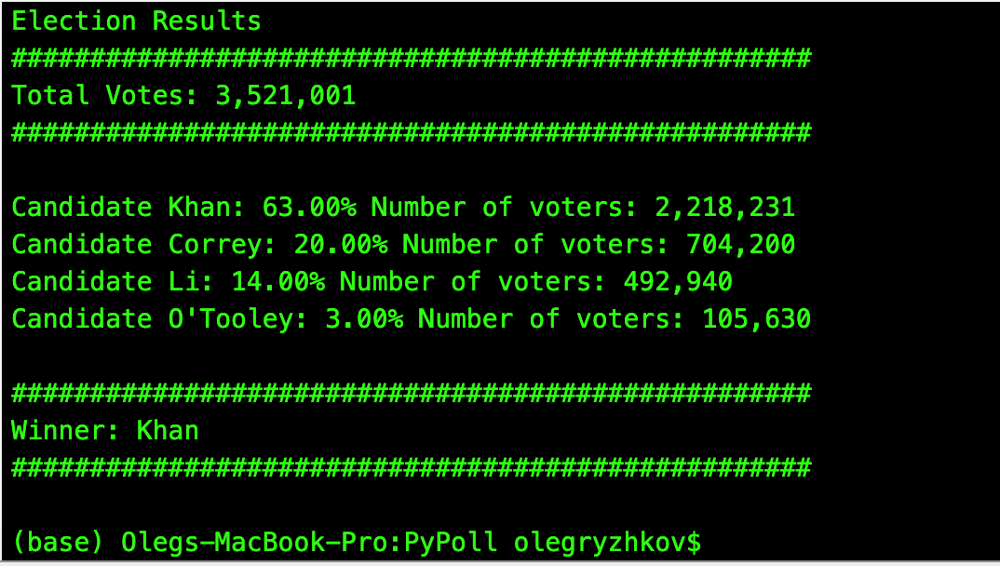

# PyPoll-challenge

Analysis of the election results from a given set of a data called [election_data.csv] (PyPoll/Resources)

## Assignment

The task is to create a Python script that helping a small, rural town modernize its vote counting process by calculating each of the following:

  * The total number of votes cast

  * A complete list of candidates who received votes

  * The percentage of votes each candidate won

  * The total number of votes each candidate won

  * The winner of the election based on popular vote.

  * In addition, the  final script should both print the analysis to the terminal and export a text file with the results.

## Summary Analysis Output to the Terminal

## Contacts
[Find Me on
LinkedIn](https://www.linkedin.com/in/oleg-n-ryzhkov/)
